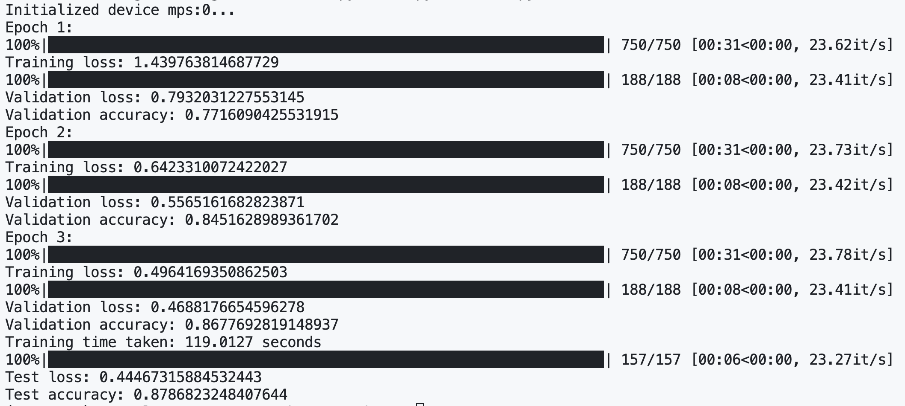

# NumX - A Deep Learning Framework

## Overview
**NumX** is a deep learning framework built from scratch in C++ with Python bindings, designed with a PyTorch-like API. The framework is actively optimized for performance and currently supports Metal GPU acceleration. Future releases will include CUDA support for NVIDIA GPUs.

## Requirements
A virtual environment(e.g., Conda) is recommended before installing Python packages. The following software is needed to run NumX:
- C++ 23
- CMake >= 3.30
- Python 3.12+
- NumPy >=2.0
- Nanobind >= 2.7.0 (Python package for C++ bindings)
- Metal 4 and metal-cpp for macOS 26 and above
- Pytest >= 8.3.4 (optional, mainly for testing NumX in Python)

## Installation
1. Clone the repository
```bash
git clone https://github.com/dashluu/numx.git
cd numx
```

2. Build the project
Do the following on macOS from the project root:
* Build the project and generate `.so` and `.pyi` file using the following commands:
```bash
cd numx
cmake -S . -B build
cmake --build build
```
The Python modules are automatically generated in the `python` directory.


## Usage
The following assumes you will be writing code in the `python` directory. If you want to write your code elsewhere, move `.so` and `numx` folder, which contains generated Python modules, to the directory you are writing your code in.

1. Import `numx.core` in your Python code:
```python
from numx.core import Array, f32, full, from_numpy
from numx.random import normal
```

2. Initialize arrays:
```python
shape = [2, 3, 4]
# Create an array of the specified shape and of type float with normal distribution values
x1 = normal(shape)
x2 = normal(shape)
x3 = full(shape, 2.0, dtype=f32)
```

3. Define computations and run:
```python
# Define computation graph
# Make sure the value is a single element before evaluation and backpropagation
x4 = ((x1 + x2) * x3).exp().sum()
# Execute both forward and backward pass once backward is called
x4.backward()
```

Check out an example of `main.py` inside `python` directory:
```python
from numx.core import Array, f32, zeros, ones
import numpy as np
import torch

arr1 = zeros([2, 5, 3])
arr2 = arr1[:, 1:4]
arr2 += ones([2, 3, 3])
# print triggers the computational graph to be compiled and executed
print(arr2)
```

There are a few more modules than just `core`:
* `core` contains `Array`, basic data types, and array operations.
* `random` contains random number generating functions such as `normal`, `uniform`, etc.
* `nn` contains important modules and functions to implement neural networks such as `linear`, `onehot`, etc.
* `optim` contains optimizer implementations for updating neural network parameters.

## Features
- Automatic differentiation
- Native Metal GPU v4 acceleration for Apple Silicon
- Custom compute kernels written from scratch
- Full computational graph forward and backward propagation
- Supported operations:
  - Initialization operations: `full`, `arange`, `ones`, `zeros`
  - Random operations: `uniform`, `normal`, `kaiming_uniform`, `randint`, `randbool`
  - Array transformation operations: `reshape`, `permute`, `slice`, `transpose`
  - Matrix multiplication `matmul`
  - Element-wise operations: `add`, `sub`, `mul`, `div`, `pow`, `exp`, `log`, `neg`(negation), `recip`(reciprocal), `sqrt`, `sq`(square), `bitwise_and`, `bitwise_or`, `bitwise_xor`
  - Reduction operations: `sum`, `mean`, `max`, `min`, `argmax`, `argmin`
- NumPy, PyTorch integration:
  - `from_numpy` converts a numpy array to numx array.
  - `numpy` converts a numx array to a numpy array.
  - `torch` converts a numx array to a PyTorch tensor.
- The only data types currently supported are `f32`(float32), `i32`(int32), and `b8`(bool).
- **Modules**: Linear
- **Loss functions**: Cross-entropy Loss
- **Optimizers**: vanilla Gradient Descent

## Changes compared to v1
- Memory allocator: replaced hash maps with vectors for better cache locality
- Metal 4 migration: adopted argument tables and residency sets
- Matmul rewrite: reimplemented using Metal 4 tensor operations, on par with the previous hand-tuned kernel and automatically leverages the new neural accelerator on newer devices

## Todos
- [ ] Memory profiler to detect memory leaks
- [ ] `cat` tensor operation
- [ ] `stack` tensor operation
- [ ] Embedding layer
- [ ] Support more activation functions
- [ ] Support more optimizers
- [ ] Kernel fusion
- [ ] Asynchronous dispatch support

## Examples
- Check out the `python/tests` directory for example implementations of:
  - Array operations
  - Gradient calculations
  - Metal backend usage
  - PyTorch comparison tests
  - Basic neural network and functional operations.
- Also check out `python/mnist.py` for an example of training a neural network on the `mnist` dataset. One thing is that the training process is still running slow and performance improvement is in the work.
- Here is the output from the MNIST example:



## Acknowledgement
These resources inspired me to do the project:
- MLX by Apple (https://github.com/ml-explore/mlx)
- PyTorch by Meta (https://github.com/pytorch/pytorch)
- Tinygrad by George Hotz (https://github.com/tinygrad/tinygrad)
- Micrograd by Karpathy (https://github.com/karpathy/micrograd)
- Deep Learning Systems (https://dlsyscourse.org/lectures)
- Metal matmul testing (https://github.com/bkvogel/metal_performance_testing)
